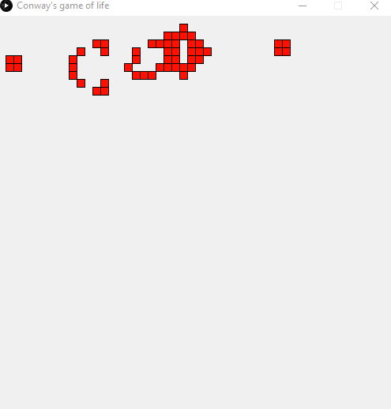

# conways-game-of-life

A Quil sketch designed to display an animation of Conway's game of life

## Usage

LightTable - open `core.clj` and press `Ctrl+Shift+Enter` to evaluate the file.

Emacs - run cider, open `core.clj` and press `C-c C-k` to evaluate the file.

REPL - run `(require 'conways-game-of-life.core)`.

## License

Creative Commons Zero
